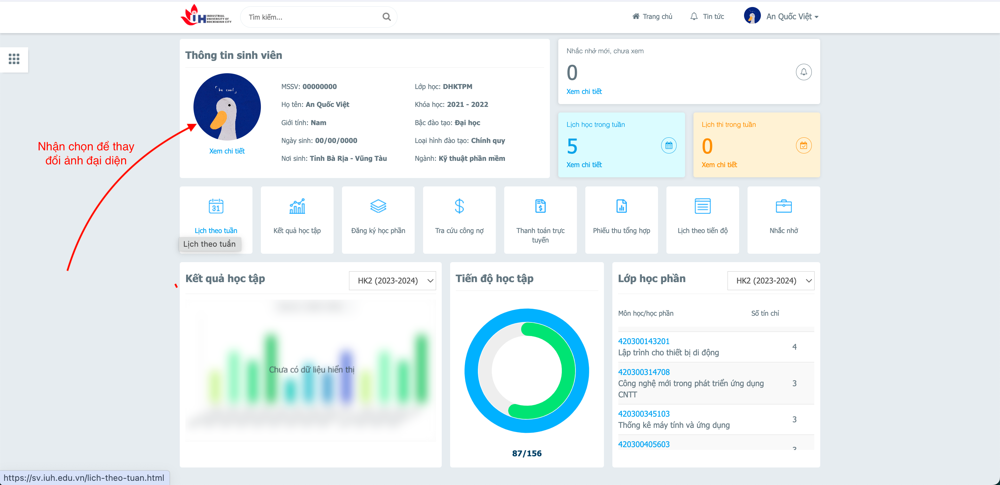

# IUH_Toolkit

Extension hỗ trợ sinh viên IUH thao tác dễ dàng hơn trên hệ thống trang web của trường

-  [Các tính năng](#các-tính-năng)
-  [Hướng dẫn sử dụng](#hướng-dẫn-sử-dụng)
   -  [Hướng dẫn thay đổi ảnh đại diện](#hướng-dẫn-thay-đổi-ảnh-đại-diện)
   -  [Hướng dẫn lấy key](#hướng-dẫn-lấy-key)
-  [Cập nhật phiên bản](#cập-nhật-phiên-bản)
-  [Liên hệ](#liên-hệ)

## Các tính năng

-  Tự động điền khảo sát (nếu có) khi đăng nhập vào trang sinh viên
-  Xem điểm, lịch học nhanh chóng mà không cần đăng nhập
   > Chỉ cần nhập key lần đầu
-  Tính điểm của học phần trên hệ thống của trường, giao diện dành cho sinh viên và phụ huynh
-  Thay đổi ảnh đại diện trên trang sinh viên (chỉ thay đổi về mặt giao diện trên máy của bạn)

## Hướng dẫn sử dụng:

### Hướng dẫn thay đổi ảnh đại diện
Đăng nhập vào hệ thống của trường vào nhấn chọn đổi ảnh đại diện

### Hướng dẫn lấy key

1. Vào trang https://sv.iuh.edu.vn/tra-cuu-thong-tin.html
   
2. Nhấn vào xem điểm hoặc lịch theo tuần để mở trang mới và lấy key
   
3. Copy đoạn mã trên url, đó chính là key cần lấy để sử dụng. Bạn chỉ cần lấy key 1 lần duy nhất khi sử dụng extension.
   

   **Lưu ý: vì lấy dữ liệu từ trang dành cho phụ huynh nên khi xem lịch thi không có phần danh sách nhóm thi. Bạn hãy đăng nhập vào hệ thống của trường để xem được đầy đủ nhất nhóm thi**

## Cập nhật phiên bản

**Update version 1.0.4**

- Sửa lỗi tính điểm tổng kết của kỳ

## Liên hệ:

Nếu trong quá trình sử dụng, bạn có thắc mắc hay mong muốn chức năng cho extension, bạn có thể liên hệ với mình qua [Facebook](https://www.facebook.com/anq.viet203) hoặc qua [Telegram](https://t.me/anquocviet)
